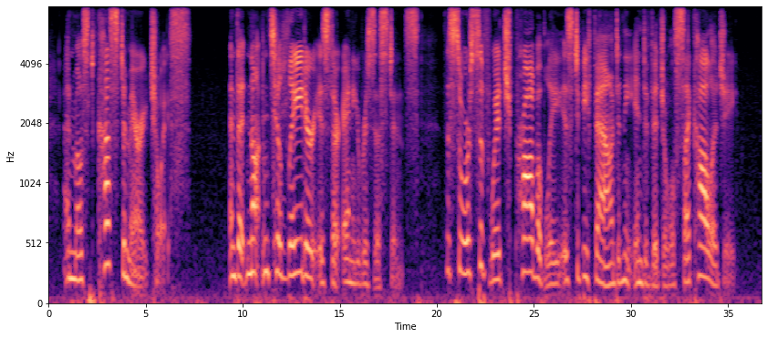
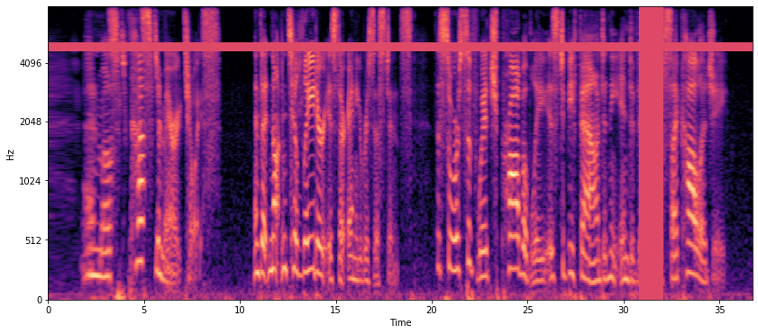

> SpecAugment: A Simple Data Augmentation Method for Automatic Speech Recognition
> Park, Daniel S. and Chan, William and Zhang, Yu and Chiu, Chung-Cheng and Zoph, Barret and Cubuk, Ekin D. and Le, Quoc V.
> Interspeech 2019
> [[Paper]](http://dx.doi.org/10.21437/Interspeech.2019-2680)
# About
This repository contains a implementation of the augmentation methodology proposed in the above paper.


##### Base Input
<figure>
  
</figure>

##### SpecAugmented Output (Policy = 'LB')
<figure>
  
</figure>

### Requirements:
1. python3
2. librosa
3. libsndfile
4. audioread
5. ffmpeg
5. numpy
6. tensorflow
7. tensorflow_addons

### Usage:
```
main.py [--dir][--policy]
```

--dir    | path/to/dataset | default='./LibriSpeech/'\
--policy | augmentation policy to use from {'LB','LD', 'SS', 'SM'} | deafault='LD'

OR

```
refer to demo/demo.ipynb for jupyter notebook demo
```


### References:
1. @article{Park_2019,
   title={SpecAugment: A Simple Data Augmentation Method for Automatic Speech Recognition},
   url={http://dx.doi.org/10.21437/Interspeech.2019-2680},
   DOI={10.21437/interspeech.2019-2680},
   journal={Interspeech 2019},
   publisher={ISCA},
   author={Park, Daniel S. and Chan, William and Zhang, Yu and Chiu, Chung-Cheng and Zoph, Barret and Cubuk, Ekin D. and Le, Quoc V.},
   year={2019},
   month={Sep}
}
